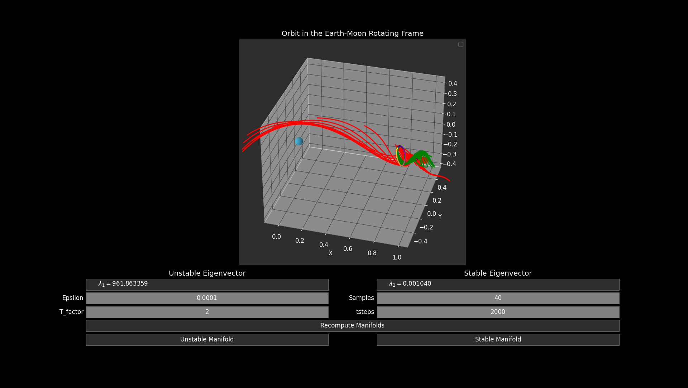
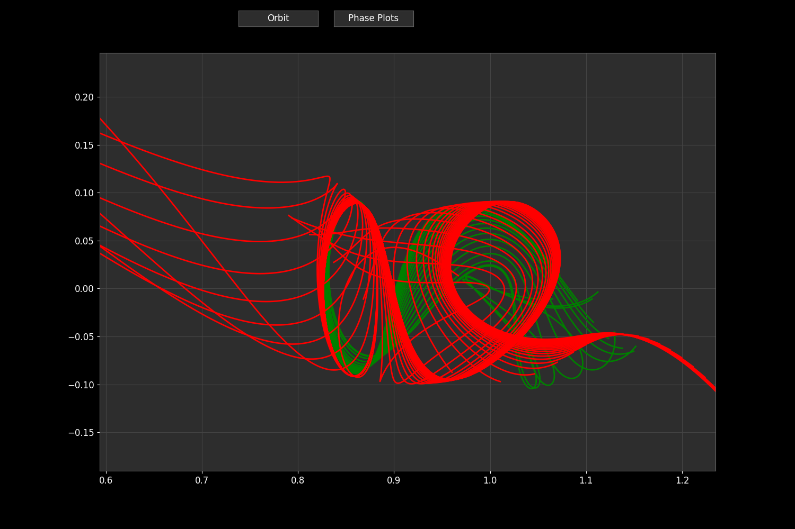

# ThreeFold
Invariant manifold and three-body periodic orbits analysis code.

Compute periodic orbits in the Earth-Moon system using initial conditions with simulation.py. Compute and view the the various stable and unstable invariant manifolds with the plotDashboard.py, an interacitve matplotlib based GUI. Warning, the GUI is very slow. Future work might include a customs rendering engine.  

It also includes the file `state_library.py`, which is a dictionary of interesting inital states in the E-M CR3BP. A simple representative L1 halo orbit is shown in the Earth-Moon synodic frame below using it's name in the state library, 'Halo', along with some of its stable (green) and unstable (red) invariant manifolds.

