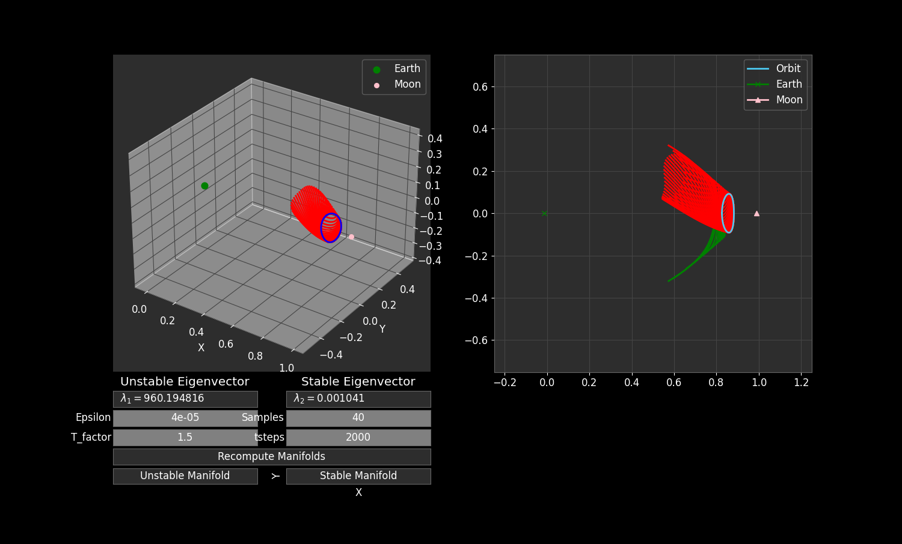
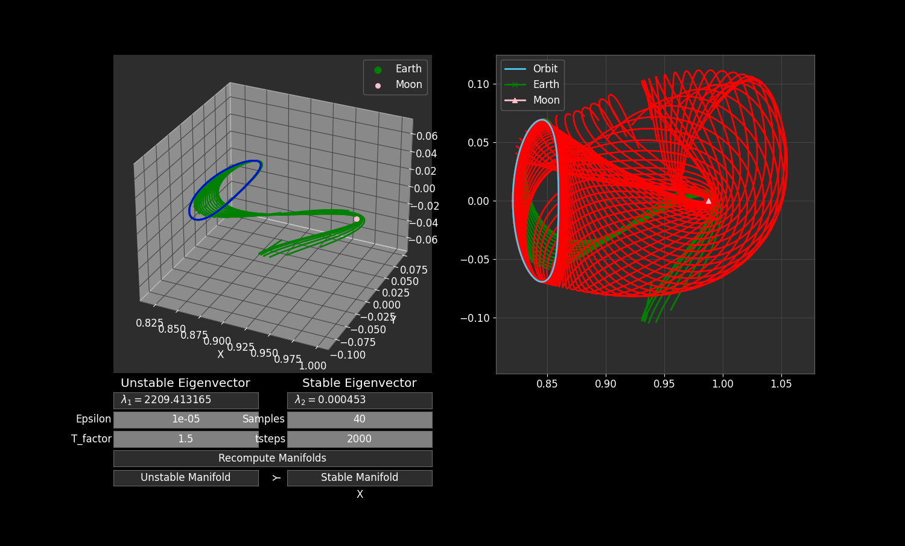

# ThreeFold
Invariant manifold and three-body periodic orbits analysis code.

Compute periodic orbits in the Earth-Moon system. Input desired initial conditions (https://ssd.jpl.nasa.gov/tools/periodic_orbits.html is a great resource) into simulation.py and propogate the orbit for one period. Alternatively, use the file `state_library.py`, which is a dictionary of interesting inital states in the E-M CR3BP. View the the various stable and unstable invariant manifolds with the plotDashboard.py, an interacitve matplotlib based GUI. See the periodic orbit and the manifolds in 3D or 2D. The stable and unstable eigen-values of the monodromy matrix are shown below the 3D plot. You may select and change the numerical parameters for the manifold computation via the text boxes directly under the eigen-values. 

A simple representative L1 halo orbit is shown in the Earth-Moon synodic frame below using it's name in the state library, 'L1-Halo'. The 2D manifolds for an L1-Lyapunov orbit are shown below it, with the stable (green) and unstable (red) invariant manifolds.

